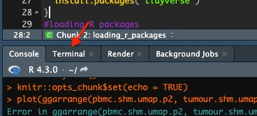
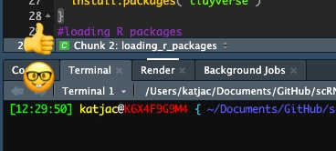
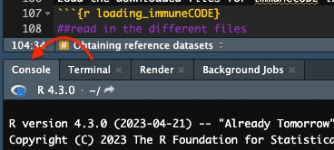

```{r setup, include=FALSE}
knitr::opts_chunk$set(echo = TRUE)
```

## Overview

The epitope specificity of T cells may be inferred by matching TCRs to a reference database of clonotypes of known specificity. TCRs of known specificity will be collected from two sources and formatted for consistency with the clonotype labels used in our analysis of the single cell VDJ data.

The RScript for this workflow is available on [github](https://raw.githubusercontent.com/kjlj/scRNA-seq_VDJ/main/RScripts/generating_Ag_reference_TRB.R) in the [workshop respository](https://github.com/kjlj/scRNA-seq_VDJ).

## Setting up R session

Only require the tidyverse packages:
```{r loading_r_packages}
#loading R packages
#tidyverse packages for data manipulation and plotting
#check if the package is already installed, if not, install it
if (sum(grepl("tidyverse", rownames(installed.packages()))) > 0) {
  print("tidyverse is already installed")
} else {
  install.packages("tidyverse")
}
#loading R packages
library(tidyverse)
```

## Obtaining reference datasets

There are two data sources from which TCRs will be collected. The first is a large set of SARS-CoV-2 TCRs from [immuneCODE](https://clients.adaptivebiotech.com/pub/covid-2020) ([see the paper here](https://www.ncbi.nlm.nih.gov/pmc/articles/PMC7418738/)). The second has a more diverse range of specificities and is called [VDJdb](https://vdjdb.cdr3.net/) ([see the paper here](https://www.nature.com/articles/s41592-022-01578-0)).

To download need to switch from 'Console' to 'Terminal' in RStudio.




When working on Posit Cloud need to run the following in the 'Terminal' tab within RStudio but on local computer to opt between Terminal within RStudio or switch to regular Terminal.

First create a location to store the downloaded references:
```{bash downloading_references1}
#obtaining TCRs of known specificity

#if running on local computer change to the directory of your choice, on posit cloud start in the /cloud/project/ directory which is the default
#cd ~/Documents/GitHub/scRNA-seq_VDJ/

#make a new directory to store the references
mkdir -p tcr_ag_refs/vdjdb/
mkdir -p tcr_ag_refs/immuneCODE/
```

Using cURL to obtain the VDJdb from their [github release page](https://github.com/antigenomics/vdjdb-db/releases/):
```{bash downloading_references2}
#change to the directory created for vdjdb
cd tcr_ag_refs/vdjdb/

#downloading the file with cURL, need to include the -L option to follow the redirect
curl -L -O https://github.com/antigenomics/vdjdb-db/releases/download/2023-06-01/vdjdb-2023-06-01.zip

```

The database files are distributed as a zip archive, so uncompress it:
```{bash downloading_references3}
cd tcr_ag_refs/vdjdb/

#uncompress the file
unzip vdjdb-2023-06-01.zip
```

Moving onto the immuneCODE dataset which can be found on the [Adaptive Biotech hosted page](https://clients.adaptivebiotech.com/pub/covid-2020). 

Change to the immuneCODE directory we already made and then use cURL to download the file:
```{bash downloading_references4}
#change to the directory created for immuneCODE
cd tcr_ag_refs/immuneCODE/

#download the file
curl -O https://adaptivepublic.blob.core.windows.net/publishedproject-supplements/covid-2020/ImmuneCODE-MIRA-Release002.1.zip

```

As for vdjdb, the files come in a zip archive that needs to be 'unzipped', but we also need to move the files out of the sub-directory they uncompress to:
```{bash downloading_references5}
cd tcr_ag_refs/immuneCODE/

#uncompress the file
unzip ImmuneCODE-MIRA-Release002.1.zip

#relocate the files from within the sub-directory
mv */* ./ 

#delete the now empty sub-directory
rmdir ImmuneCODE-MIRA-Release002.1
```


Now, move back from the 'Terminal' to the 'Console'. The files that were just obtained can be browsed in the 'Files' tab within RStudio.



Now that we are back in the R, we can load the downloaded files for immuneCODE into R and reformat to match our clonotype labels 

There are TCRs (only the TRB chains) from three different assays: minigene, class I peptides, and class II peptides.

All three will be used:
```{r loading_immuneCODE}
##read in the different files
immunecode.data1 <- read_csv("tcr_ag_refs/immuneCODE/minigene-detail.csv")
immunecode.data2 <- read_csv("tcr_ag_refs/immuneCODE/peptide-detail-ci.csv")
immunecode.data3 <- read_csv("tcr_ag_refs/immuneCODE/peptide-detail-cii.csv")
```

For immuneCODE the clonotype information is in the `TCR BioIdentity` column and the format is like CASGRHNSPLHF+TCRBV12-03/12-04+TCRBJ01-06. The junction AAs, TRBV and TRBJ can be extracted by splitting this at '+', but the gene names used in immuneCODE differ from the IMGT labels (TCRBJ01-06 vs. TRBJ1-6) and there can be multiple entries for the V gene (TCRBV12-03/12-04). To convert the junction AAs to CDR3 AAs we need to remove the first and last AAs that are the CDR3 anchor residues (the 104-Cys and 118-Phe/Tyr). 

The manipulation is:
1. split at '+' to get junction, V(s) and J
2. split the Vs into first (v1) and second (v2) at '/', second will be NA if there isn't a secondary V
3. if there is a second V, add the TRBV prefix to the gene family-number
4. use pivot longer on the v1 and v2 columns, this will create a separate entry for each V associated with a CDR3 + J + antigen combination
5. remove any entries where the V is NA, these are extra entries created from clonotypes that didn't have secondary V genes
6. reformat the gene labels for the V and Js by changing the TCRBV to TRBV and the TCRBJ to TRBJ and removing the 0 padding of the family/gene numbers

```{r reformat_immuneCODE}
##combine into a single tibble and separate out the TCR clonotype information that is in the TCR BioIndenity columns
immunecode.data <- bind_rows(immunecode.data1 %>% select(tcr = `TCR BioIdentity`, epitope = ORF),
                             immunecode.data2 %>% select(tcr = `TCR BioIdentity`, epitope = `ORF Coverage`),
                             immunecode.data3 %>% select(tcr = `TCR BioIdentity`, epitope = `ORF Coverage`)) %>% #combine the files
  separate(tcr, into = c("junction_aa", "v", "j"), sep = "\\+", remove = FALSE) %>% #separate the TCR info into different fields
  separate(v, into = c("v1", "v2"), sep = "\\/", remove = FALSE, fill = "right") %>% #some entries include multiple V genes so need to split these
  mutate(v2 = ifelse(!(is.na(v2)), paste0("TRBV", v2), NA_character_)) %>% #the genes from second entry are missing the prefix, add it
  pivot_longer(cols = c(v1, v2),
               values_to = "trbv",
               names_to = "v_alt") %>% #want to create two separate entries for the different V genes, start by casting data longer
  filter(!(is.na(trbv))) %>% #remove the NAs, these are from entries that only had a single V gene
  select(-c(v_alt, tcr, v)) %>% #remove some of the extra columns generated
  mutate(antigen = "SARS-COV-2", #flagging that all are COV2
         trbv = str_replace(trbv, "TCRBV0", "TRBV"), #the gene names use TCRBV rather than TRBV, also have leading 0 that aren't in IMGT gene labels
         trbv = str_replace(trbv, "TCRBV", "TRBV"), #fixing the TCRBV for genes without the leading 0
         trbv = str_replace(trbv, "-0", "-"), #there are also 0 padding the gene number that need to be removed to make IMGT labels
         j = str_replace(j, "TCRBJ0", "TRBJ"), #fixing the 0 padding for the J gene family
         j = str_replace(j, "-0", ""), #fixing the 0 padding for the J gene number
         trbv = str_replace(trbv, "TRBV20-X", "TRBV20-1"), #fixing the -X
         cdr3_aa = str_replace_all(junction_aa, "^.|.$", ""), #the cdr3s in immuneCODE are include the anchors, 10x ones don't, this removes the first and last AAs
         clonotype = paste(trbv, j, cdr3_aa, sep = "_"), #generate the clonotype label
         source = "immuneCODE") %>% #add a column that indicates that the source of the sequences is immuneCODE
  filter(!grepl("nproductiv", clonotype)) #remove the non-productive rearrangements
immunecode.data
```

Finally, restrict the columns and ensure that all entries are unique as we combined across the three assays:
```{r reformat_immuneCODE2}
##reformat the data
immunecode.data <- immunecode.data %>% 
  select(clonotype, gene = epitope, antigen, source) %>%
  unique()

immunecode.data %>% head()
```

Formatting VDJdb to the same format is a little less effort as the gene names are already in IMGT format. 

For VDJdb the adjustments are:
1. filter to only entries that include a TRB with V, J and CDR3 information
2. restrict the species to humans as this reference includes TCRs from other species such as mice
3. remove the alleles from the V and J
4. once again the CDR3 includes the anchors, so these are removed
5. make the clonotype label from the V, J and CDR3s

```{r formatting_vdjdb_trbs}
##loading the vdjdb data
vdjdb.data <- read_tsv("tcr_ag_refs/vdjdb/vdjdb_full.txt") %>%
  filter(!is.na(cdr3.beta)) %>% #only keep entries with a TRB CDR3 AA sequence
  filter(!is.na(v.beta)) %>% # only keep entries with a TRBV gene
  filter(!is.na(j.beta)) %>% # only keep entries with a TRBJ gene
  filter(species == "HomoSapiens") %>% # only keep human TCRs
  mutate(vb = str_replace(v.beta, "\\*.+$", ""), #remove the allele from the TRBV
         jb = str_replace(j.beta, "\\*.+$", ""), #remove the allele from the TRBJ
         cdr3 = str_replace_all(cdr3.beta, "^.|.$", ""), #remove the anchor residues from the start/end of the junction AAs
         clonotype = paste(vb, jb, cdr3, sep = "_")) %>% #make the clonotype label
  select(clonotype, antigen = antigen.species, gene = antigen.gene) %>% # select the columns of interest
  unique() %>% # remove any duplicate entries that may have been reported from different studies
  mutate(source = "vdjdb") #add a source for the reference sequences

vdjdb.data %>% head()
```

Now that the immuneCODE and vdjdb clonotypes are in the same format we can combine into a single dataset. To avoid complications when using the dataset to annotate single cell data we only want a single entry for each unique clonotype. The same clonotype may have been reported by the two sources or it may be that the same clonotype has been mapped to multiple epitopes (i.e. a cross-reactive TCR). If this is the case, the multiple sources/epitopes will be retained as a comma-separated list in the gene/antigen/source columns:
```{r combining_immunecode_vdjdb}
#combining the databases
tcr.antigen.data <- bind_rows(immunecode.data %>% mutate(database = "immuneCODE"), 
                              vdjdb.data %>% mutate(database = "vdjdb")) %>% #joining the immunecode + vdjdb clonotypes
  group_by(clonotype) %>% #grouping by clonotype label
  summarise(gene = str_c(unique(gene), collapse = ","), #if there are multiple genes, combine to a single string separating each by a comma
            antigen = str_c(unique(antigen), collapse = ","), #if there are multiple antigens, combine to a single string separating each by a comma
            database = str_c(unique(database), collapse = ",")) %>% #if there are multiple sources, combine to a single string separating each by a comma
  ungroup() #remove the clonotype grouping

#print the top of the tibble
tcr.antigen.data %>% head()
```

How many clonotypes are in the set?
```{r how_many_clonotypes}
tcr.antigen.data %>% nrow()
```

A quick summary of the clonotypes and their associated antigens:
```{r antigen_summary}
tcr.ag.tbl <- tcr.antigen.data %>% 
  group_by(antigen) %>%
  summarise(cnt = length(clonotype)) %>%
  ungroup() %>%
  arrange(desc(cnt))
tcr.ag.tbl
```

The clonotype reference will be used for future steps so write it to a tab-delimited file (don't use comma delim here as there are those commas within data fields!):
```{r write_output}
#save the tcr antigen file for later use
write_tsv(tcr.antigen.data, "tcr_ag_refs/trb_antigens.tsv")
```

No longer need the immuneCODE and vdjdb files used to build the reference. 

Go back to 'Terminal' tab and remove the files that are no longer required:


```{bash remove_downloads}
#on posit cloud
#cd /cloud/project/

#if on local change to directory used for downloads
#cd ~/Documents/GitHub/scRNA-seq_VDJ/tcr_ag_refs/

#remove the immuneCODE sub-directory
rm -rf tcr_ag_refs/immuneCODE
#remove the vdjdb sub-directory
rm -rf tcr_ag_refs/vdjdb
```

[Return to main page.](https://kjlj.github.io/scRNA-seq_VDJ)

[Go to annotating T cells in single cell data](https://kjlj.github.io/scRNA-seq_VDJ/docs/antigen_annotation_T_cells.html)
